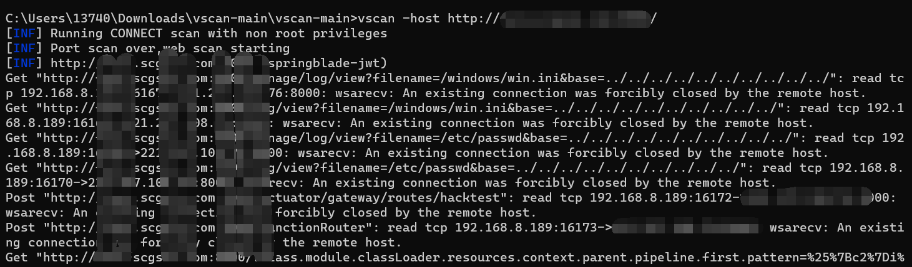
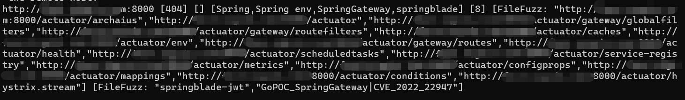

# VscanPlus

更新版本的vscan，开源、轻量、快速、跨平台 的网站漏洞扫描工具，帮助您快速检测网站安全隐患。

# Features

# Updates

- ehole指纹更新
- nuclei检测脚本更新
- xray检测脚本更新
- 支持xray yml v2语法
- 规范指纹名称，nuclei、xray检测脚本命名格式

# Reference

https://github.com/veo/vscan
