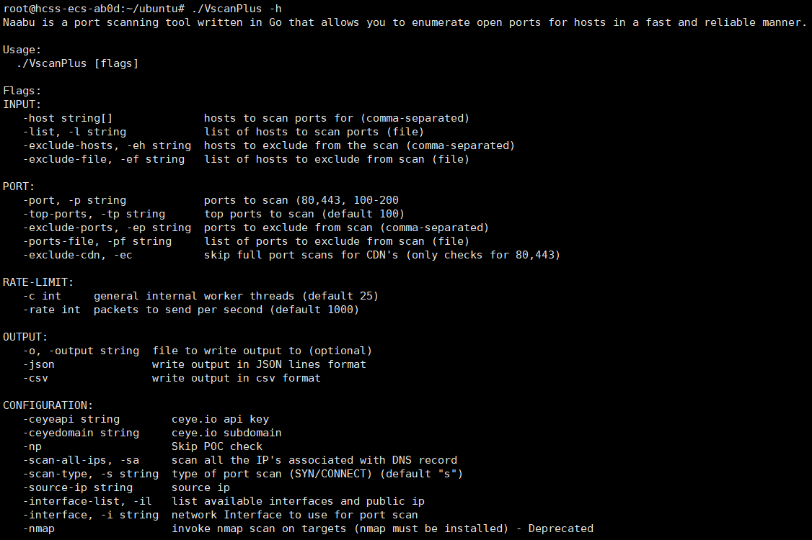
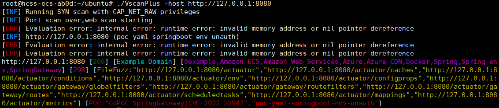
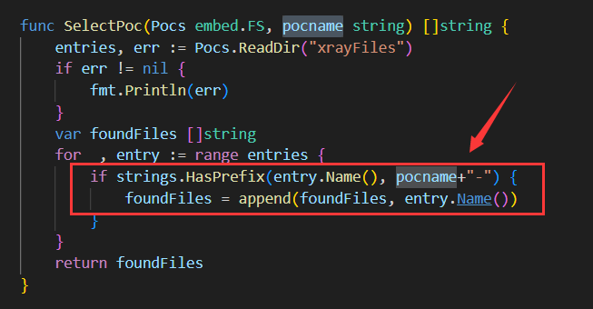
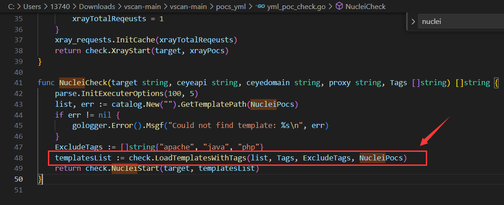

<h1 align="center">
  <b>VscanPlus</b>
   
</h1>

VscanPlus is a second development version of Vscan, an open-source, lightweight, fast, cross-platform website vulnerability scanning tool that helps you quickly detect website security vulnerabilities.

  <a href="/README_zh.md">中文文档</a> •
  <a href="/static/Installation.md">Compilation/Installation/Running</a> •
  <a href="/static/usage.md">Parameter Description</a> •
  <a href="/static/running.md">Usage</a> •

# Features

# Updates

- Updated ehole fingerprint
- Updated nuclei detection scripts
- Updated xray detection scripts
- Fixed missing field error when reading nuclei templates
- Standardized fingerprint names, nuclei, xray detection script naming format

# Commits

- According to the original vscan development documentation, users can customize fingerprints and pocs. The calling relationship between the two is: first detect the fingerprint, then call the corresponding poc, similar to the recently updated -ac command line detection feature in nuclei, both based on fingerprints to detect vulnerabilities

    

- According to the original vscan development documentation, the xray poc naming format corresponding to the fingerprint is: fingerprint-xxxx-yml, so the format of the newly added pocs has been standardized, including:
``
Weaver-OA
Yonyou-OA
Tongda-OA
Jinhe-OA
ThinPHP
Spring-Boot
Spring-Blade
Apache-Tomcat
Drupal
Microsoft-Exchange
Sangfor
``

- Nuclei loads pocs through tags

    

- ~~Based on the xray rule detection of the original vscan, the logic of loading multiple rules in yml v2 similar to nuclei templates has been rewritten, which can achieve multi-expression detection functionality~~

- The fuzzy detection feature for subdomain name takeover vulnerabilities is added
``
Based on the detection rules in the https://github.com/EdOverflow/can-i-take-over-xyz project, the corresponding domain name is determined to have a subdomain name takeover vulnerability by comparing the domain name CNAME resolution and the request return information. After the detection is complete, a matched_domains.txt file is generated in the current directory.
``

# Todo

- Fix bugs related to some detection scripts failing to load

# Warning

- To compile and generate executable files, please download the vcsanplus-main-code.zip file from the releases

**本工具由C4安全团队二次开发和维护**

**团队公开群**
- QQ群一群（772375860）

# Reference

https://github.com/veo/vscan

# Star History

