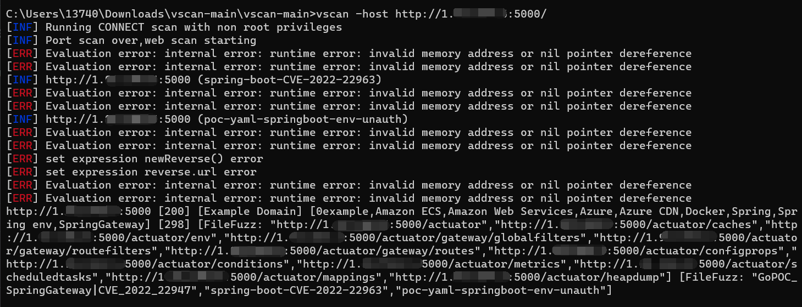

<h1 align="center">
  <b>VscanPlus</b>
   
</h1>

二次开发版本的vscan，开源、轻量、快速、跨平台 的网站漏洞扫描工具，帮助您快速检测网站安全隐患。

# Warning

- 如需编译生成可执行文件，请下载release中的vcsanplus-main.zip文件

# Features

# Updates

- ehole指纹更新
- nuclei检测脚本更新
- xray检测脚本更新
- 支持xray yml v2语法
- 修复nuclei模板读取缺失字段报错
- 规范指纹名称，nuclei、xray检测脚本命名格式

# Commits

- 根据原vscan开发文档，用户可以自定义指纹和poc，两者的调用关系是：先检测指纹，再调用对应poc，类似于nuclei前不久更新的-ac命令行的检测功能，都是基于指纹来检测漏洞

    

- 根据原vscan开发文档，指纹对应的xray poc命名格式为：指纹-xxxx-yml，因此对新增的poc进行了格式统一，包括：
``
泛微oa 
用友oa
通达oa
thinphp
spring-boot
springblade
apache-tomcat
drupal
microsoft-exchange
sangfor
``

- nuclei则是通过tags加载poc

    

- 在原vscan的xray单规则检测基础上，更新为yml v2多规则检测，可以实现多表达式的检测功能

# Todo

- 待修复nuclei的yaml脚本中如果带有dnslog字段{{interactsh-url}}，无法渲染成功的问题

# Reference

https://github.com/veo/vscan
