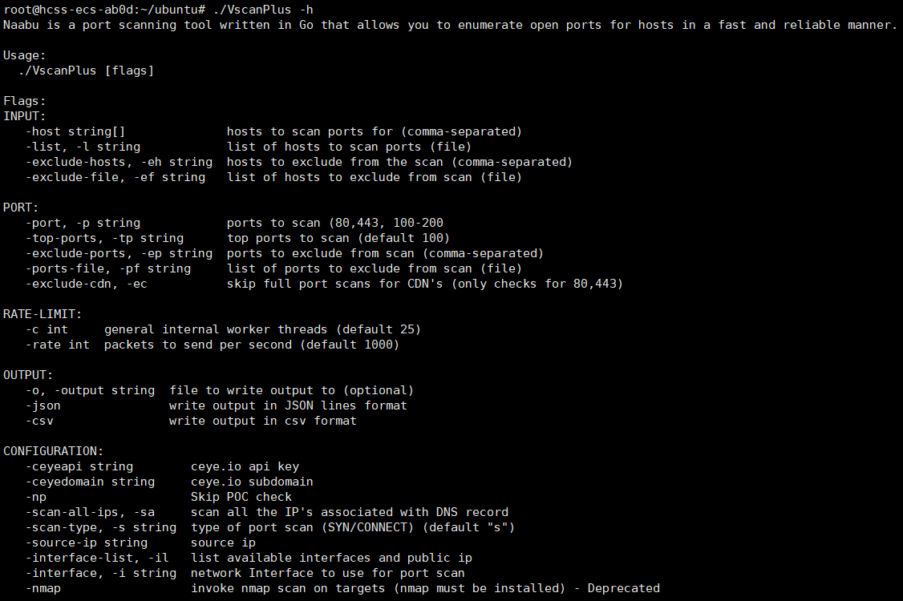
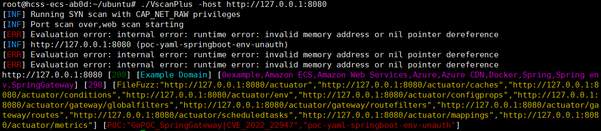
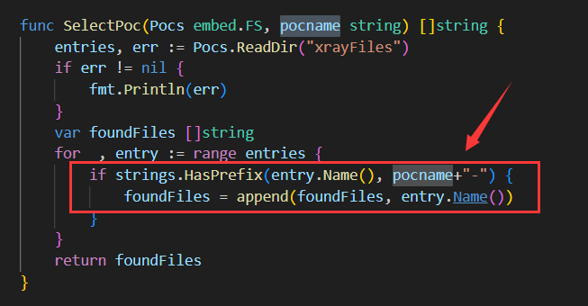
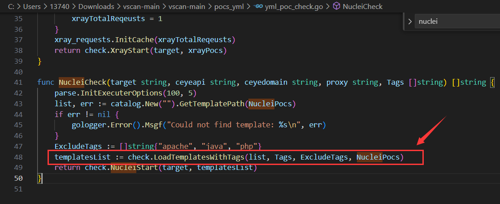

<h1 align="center">
  <b>VscanPlus</b>
  <br>
</h1>
<p align="center">二次开发版本的vscan，开源、轻量、快速、跨平台 的网站漏洞扫描工具，帮助您快速检测网站安全隐患。</p>

<p align="center">
<a href="https://github.com/youki992/VscanPlus/issues"></a>
<a href="https://github.com/youki992/VscanPlus"></a>
<a href="https://github.com/youki992/VscanPlus/releases"></a>
<a href="https://github.com/youki992/VscanPlus/releases"></a>
</p>

<p align="center">
  <a href="/static/Installation.md">编译/安装/运行</a> •
  <a href="/static/usage.md">参数说明</a> •
  <a href="/static/running.md">使用方法</a> •
</p>

# Features





# Updates

- ehole指纹更新
- nuclei检测脚本更新
- xray检测脚本更新
- 支持xray yml v2语法
- 修复nuclei模板读取缺失字段报错
- 规范指纹名称，nuclei、xray检测脚本命名格式

# Commits

- 根据原vscan开发文档，用户可以自定义指纹和poc，两者的调用关系是：先检测指纹，再调用对应poc，类似于nuclei前不久更新的-ac命令行的检测功能，都是基于指纹来检测漏洞

<div style="text-align: center;">
    
</div>

- 根据原vscan开发文档，指纹对应的xray poc命名格式为：指纹-xxxx-yml，因此对新增的poc进行了格式统一，包括：
``
泛微oa 
用友oa
通达oa
金和oa
thinphp
spring-boot
springblade
apache-tomcat
drupal
microsoft-exchange
sangfor
其他HW热门漏洞
``

- nuclei则是通过tags加载poc

<div style="text-align: center;">
    
</div>

- ~~在原vscan的xray规则检测基础上，使用类似nuclei加载template的逻辑重写了yml v2的多规则检测，可以实现多表达式的检测功能~~

- 新增子域名接管漏洞模糊检测功能

- 新增对接ARL、FOFA读取域名的功能

``
  主要参考了https://github.com/EdOverflow/can-i-take-over-xyz项目中的检测规则，通过对比域名cname解析以及请求返回信息，判断对应域名是否存在子域名接管漏洞。检测完成后，会在当前目录下生成matched_domains.txt文件
``

# Todo

- 待修复部分检测脚本加载失败bug

# AI 决策层（多模型）

新增可选的 AI 决策辅助能力，可在扫描后自动生成 Markdown 决策报告（资产画像、优先级、下一步验证清单、风险控制），并内置规则引擎输出高/中/低风险与置信度摘要。

支持主流 OpenAI 兼容接口：`kimi / openai / deepseek / qwen / glm / openrouter / custom`

- 一键 AI 模式（推荐）：`-ai`（等价于 `-ai-enable -ai-poc-select`）
- 启用 AI：`-ai-enable`
- 仅跑 AI（不扫描）：`-ai-only`（需配合 `-ai-enable`）
- 启用 AI 选 POC（xray+nuclei）：`-ai-poc-select`（需配合 `-ai-enable` 或直接用 `-ai`）
- 选择厂商：`-ai-provider kimi`
- API Key：`-ai-api-key` 或对应环境变量
- 额外上下文：`-ai-prompt "目标是电商业务，优先关注登录与支付面"`
- 报告输出：`-ai-output ai-decision.md`

## 外部 Nuclei 调用层

用于接入最新 Nuclei 引擎和模板库：

- 启用外部 Nuclei：`-nuclei-external`
- 指定外部二进制：`-nuclei-bin`（默认 `nuclei`）
- 指定模板目录：`-nuclei-templates /path/to/nuclei-templates`（与 `-nuclei-external` 联动必填）
- 扫描前自动更新模板：`-nuclei-update`（仅对 `-nuclei-external` 生效）

## AI + 外部 Nuclei 联动

如果你要“AI 决策 + 最新模板扫描”同时开启，推荐：

```bash
./VscanPlus -host https://example.com -p 80,443,8080 -o result.txt \
  -ai -ai-provider kimi \
  -nuclei-external -nuclei-templates /opt/nuclei-templates -nuclei-update
```

参数联动（重要）：

- `-nuclei-external` 必须搭配 `-nuclei-templates`
- `-nuclei-update` 建议与 `-nuclei-external` 一起使用
- `-ai-only` 必须与 `-ai-enable` 同时使用
- `-ai-poc-select` 建议与 `-ai-enable` 或 `-ai` 同时使用

错误示例（会报错或不生效）：

```bash
# 缺少 templates 路径
./VscanPlus -host https://example.com -nuclei-external

# 单独使用 update，不会触发外部 nuclei 更新链路
./VscanPlus -host https://example.com -nuclei-update
```

环境变量映射：

- `kimi`: `KIMI_API_KEY` / `MOONSHOT_API_KEY`
- `openai`: `OPENAI_API_KEY`
- `deepseek`: `DEEPSEEK_API_KEY`
- `qwen`: `DASHSCOPE_API_KEY`
- `glm`: `ZHIPUAI_API_KEY`
- `openrouter`: `OPENROUTER_API_KEY`

示例（Kimi，单参数 AI 决策）：

```bash
export KIMI_API_KEY="your_kimi_key"
./VscanPlus -host https://example.com -p 80,443,8080 -o result.txt -ai
```

示例（DeepSeek）：

```bash
export DEEPSEEK_API_KEY="your_deepseek_key"
./VscanPlus -host https://example.com -o result.txt -ai-enable -ai-provider deepseek -ai-output ai-decision.md
```

仅根据已有输出文件生成决策：

```bash
export KIMI_API_KEY="your_kimi_key"
./VscanPlus -ai-enable -ai-only -ai-provider kimi -o result.txt -ai-output ai-decision.md
```

# Warning

- 如需编译生成可执行文件，请下载release中的vcsanplus-main-code.zip或vscanplus-code.zip文件编译

# Reference

https://github.com/veo/vscan

# Star History

[](https://star-history.com/#youki992/VscanPlus&Date)
